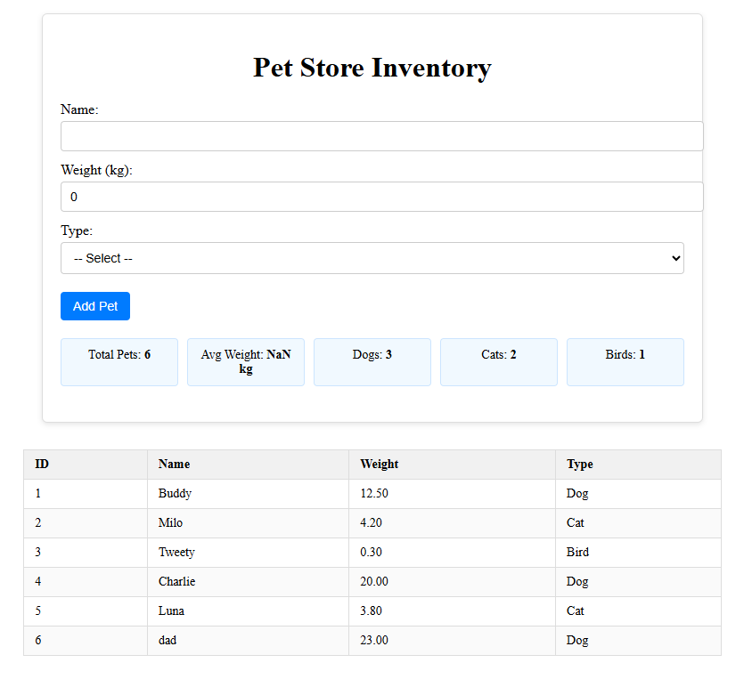

# Pet Store Inventory App

A simple web application to manage pets, built with:
- **Frontend**: Vue 3 + TypeScript
- **Backend**: Node.js + Express + TypeScript
- **Database**: PostgreSQL

---

## Features
- Add pets with **Name, Weight, Type**.
- Display pets in a table.
- Store data in PostgreSQL through backend APIs.

---

## Setup & Run

### Requirements
- [Node.js](https://nodejs.org/) >= 18
- [PostgreSQL](https://www.postgresql.org/) >= 14
- npm or yarn

---

### Project Structure
my-frist-practice/
│── front-end/ # Vue 3 + TS (client)
│── back-end/ # Node.js + Express + TS (server)

---

### 1️⃣ Database Setup
Open PostgreSQL and create a database:
```sql
CREATE DATABASE petstore;
\c petstore;

CREATE TABLE pet (
  id SERIAL PRIMARY KEY,
  name VARCHAR(100) NOT NULL,
  weight DECIMAL(5,2),
  type VARCHAR(50)
);
```

---

### 2️⃣ Backend Setup
- Go to the back-end/ folder:
  ```sh
  cd back-end
  npm install
  ```
- Create a `.env` file:
  ```env
  PORT=8081
  DB_HOST=localhost
  DB_PORT=5432
  DB_USER=postgres
  DB_PASSWORD=your_password
  DB_NAME=petstore
  ```
- Start the backend server:
  ```sh
  npm run dev
  ```

Backend available at:
👉 http://localhost:8081/api/pets

#### Backend API
- **POST** `/api/pets`
  - Content-Type: application/json
  - Example body:
    ```json
    {
      "name": "Milo",
      "weight": 5.2,
      "type": "Cat"
    }
    ```
- **GET** `/api/pets`

---

### 3️⃣ Frontend Setup
- Go to the front-end/ folder:
  ```sh
  cd front-end
  npm install
  npm run dev
  ```
- App available at: http://localhost:5173

---

## 📷 Demo UI
